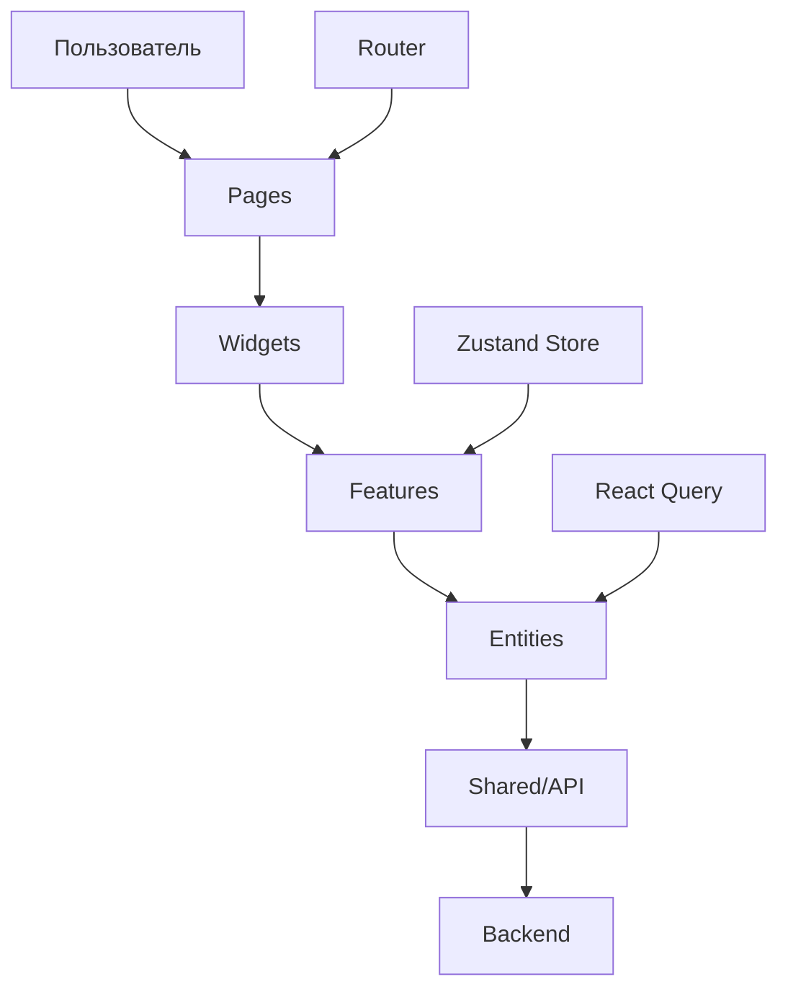

# 🌍 TravelApp - Платформа аренды жилья

> **Современное веб-приложение для поиска и бронирования жилья**  
> Разработано с использованием React, TypeScript и Feature-Sliced Design архитектуры

## 📋 Оглавление

- [🎯 Описание проекта](#-описание-проекта)
- [✨ Основные возможности](#-основные-возможности)
- [🏗️ Архитектура проекта](#️-архитектура-проекта)
- [🛠️ Технологический стек](#️-технологический-стек)
- [🚀 Быстрый старт](#-быстрый-старт)
- [📁 Структура проекта](#-структура-проекта)
- [🎨 Скриншоты](#-скриншоты)
- [👥 Для HR и менеджеров](#-для-hr-и-менеджеров)
- [👨‍💻 Для разработчиков](#-для-разработчиков)
- [📊 Производительность](#-производительность)
- [🔧 Настройка и развертывание](#-настройка-и-развертывание)

---

## 🎯 Описание проекта

**TravelApp** — это полнофункциональное веб-приложение для поиска и бронирования жилья, созданное как демонстрация современных подходов к разработке React-приложений. Проект реализует все основные функции реального сервиса аренды жилья.

### 🎪 Что это дает пользователю:

- 🔍 **Поиск жилья** по различным критериям
- ❤️ **Избранное** для сохранения понравившихся вариантов
- 📅 **Бронирование** с выбором дат и количества гостей
- 🌙 **Темная тема** для комфортного использования
- 📱 **Адаптивный дизайн** для всех устройств

---

## ✨ Основные возможности

### 🔐 Система авторизации

- **Вход в систему** с валидацией данных
- **Защищенные маршруты** для авторизованных пользователей
- **Автоматическое перенаправление** после входа
- **Сохранение сессии** в localStorage

### 🏠 Управление объявлениями

- **Каталог жилья** с детальной информацией
- **Фильтрация** по городу, цене, рейтингу
- **Сортировка** по различным параметрам
- **Пагинация** для удобной навигации
- **Поиск** по названию и описанию

### ❤️ Система избранного

- **Добавление в избранное** одним кликом
- **Фильтр "только избранные"** для быстрого доступа
- **Синхронизация** с сервером
- **Визуальные индикаторы** статуса

### 📅 Бронирование

- **Выбор дат** заезда и выезда
- **Указание количества гостей**
- **Проверка доступности** дат
- **Валидация** данных бронирования
- **Уведомления** об успешном бронировании

### 🎨 Пользовательский интерфейс

- **Современный дизайн** с использованием Tailwind CSS
- **Темная/светлая тема** с автоматическим переключением
- **Адаптивная верстка** для всех устройств
- **Плавные анимации** и переходы
- **Интуитивная навигация**

---

## 🏗️ Архитектура проекта

Проект построен на принципах **Feature-Sliced Design (FSD)** — современной методологии организации кода в React-приложениях.

### 📐 Слои архитектуры:

```
src/
├── app/           # 🏗️ Конфигурация приложения
├── pages/         # 📄 Страницы приложения
├── widgets/       # 🧩 Композитные блоки
├── features/      # ⚡ Бизнес-функции
├── entities/      # 🏢 Бизнес-сущности
└── shared/        # 🔧 Переиспользуемый код
```

### 🔄 Поток данных:



### 🎯 Принципы FSD:

1. **Изоляция** — каждый слой знает только о слоях ниже
2. **Переиспользование** — shared код доступен всем слоям
3. **Масштабируемость** — легко добавлять новые функции
4. **Тестируемость** — четкое разделение ответственности

---

## 🛠️ Технологический стек

### 🖥️ Frontend

| Технология       | Версия | Назначение            |
| ---------------- | ------ | --------------------- |
| **React**        | 18.2.0 | UI библиотека         |
| **TypeScript**   | 5.0+   | Типизация             |
| **Vite**         | 4.4+   | Сборщик               |
| **React Router** | 6.8+   | Маршрутизация         |
| **Zustand**      | 4.3+   | Управление состоянием |
| **React Query**  | 5.0+   | Серверное состояние   |
| **Tailwind CSS** | 3.3+   | Стилизация            |
| **Axios**        | 1.4+   | HTTP клиент           |
| **NProgress**    | 0.2+   | Индикатор загрузки    |

### 🧠 Backend (Mock API)

| Технология      | Версия | Назначение      |
| --------------- | ------ | --------------- |
| **Node.js**     | 18+    | Runtime         |
| **json-server** | 0.17+  | Mock API сервер |
| **Express**     | 4.18+  | HTTP сервер     |

### 🔧 Инструменты разработки

| Инструмент     | Назначение           |
| -------------- | -------------------- |
| **ESLint**     | Линтинг кода         |
| **Prettier**   | Форматирование       |
| **TypeScript** | Проверка типов       |
| **Vite**       | Горячая перезагрузка |

---

## 🚀 Быстрый старт

### 📋 Предварительные требования

- **Node.js** версии 18 или выше
- **npm** или **yarn** пакетный менеджер
- **Git** для клонирования репозитория

### 🔧 Установка и запуск

#### 1️⃣ Клонирование репозитория

```bash
git clone https://github.com/your-username/travel-app.git
cd travel-app
```

#### 2️⃣ Установка зависимостей

```bash
# Установка зависимостей для backend
cd mock-api
npm install

# Установка зависимостей для frontend
cd ../vite-project
npm install
```

#### 3️⃣ Запуск приложения

**Терминал 1 - Backend API:**

```bash
cd mock-api
npm start
# Сервер запустится на http://localhost:4000
```

**Терминал 2 - Frontend:**

```bash
cd vite-project
npm run dev
# Приложение откроется на http://localhost:5173
```

#### 4️⃣ Открытие в браузере

Перейдите по адресу: **http://localhost:5173**

### 🔑 Тестовые данные для входа

| Поле       | Значение           |
| ---------- | ------------------ |
| **Email**  | `demo@example.com` |
| **Пароль** | `password123`      |

---

## 📁 Структура проекта

```
travel-app/
├── 📁 mock-api/                 # Backend API
│   ├── 📄 server.js            # Express сервер
│   ├── 📄 db.json              # База данных
│   ├── 📄 package.json         # Зависимости backend
│   └── 📁 public/              # Статические файлы
│       └── 📁 img/             # Изображения
│
├── 📁 vite-project/            # Frontend приложение
│   ├── 📁 src/
│   │   ├── 📁 app/             # 🏗️ Конфигурация приложения
│   │   │   ├── 📁 providers/   # Провайдеры (Router, Query)
│   │   │   └── 📁 store/       # Глобальные стейты (Zustand)
│   │   │
│   │   ├── 📁 pages/           # 📄 Страницы приложения
│   │   │   ├── 📁 auth/        # Авторизация
│   │   │   ├── 📁 home/        # Главная страница
│   │   │   └── 📁 listing/     # Детали объявления
│   │   │
│   │   ├── 📁 widgets/         # 🧩 Композитные блоки
│   │   │   ├── 📁 filters-panel/    # Панель фильтров
│   │   │   ├── 📁 listing-list/     # Список объявлений
│   │   │   └── 📁 listing-details/  # Детали объявления
│   │   │
│   │   ├── 📁 features/        # ⚡ Бизнес-функции
│   │   │   ├── 📁 filters/     # Фильтрация и поиск
│   │   │   └── 📁 booking/     # Бронирование
│   │   │
│   │   ├── 📁 entities/        # 🏢 Бизнес-сущности
│   │   │   └── 📁 listing/     # Объявления о жилье
│   │   │
│   │   └── 📁 shared/          # 🔧 Переиспользуемый код
│   │       ├── 📁 api/         # HTTP клиент
│   │       ├── 📁 lib/         # Утилиты
│   │       ├── 📁 types/       # Общие типы
│   │       └── 📁 components/  # Базовые компоненты
│   │
│   ├── 📄 package.json         # Зависимости frontend
│   ├── 📄 vite.config.ts       # Конфигурация Vite
│   ├── 📄 tailwind.config.js   # Конфигурация Tailwind
│   └── 📄 tsconfig.json        # Конфигурация TypeScript
│
└── 📄 README.md                # Документация проекта
```

### 🎯 Описание слоев FSD:

#### 🏗️ **app/** - Конфигурация приложения

- **providers/** — React провайдеры (Router, QueryClient)
- **store/** — Глобальные стейты (авторизация, темы, фильтры)

#### 📄 **pages/** - Страницы приложения

- **auth/** — Страница входа в систему
- **home/** — Главная страница с каталогом
- **listing/** — Детальная страница объявления

#### 🧩 **widgets/** - Композитные блоки

- **filters-panel/** — Панель фильтров и поиска
- **listing-list/** — Список объявлений с пагинацией
- **listing-details/** — Детальная информация об объявлении

#### ⚡ **features/** - Бизнес-функции

- **filters/** — Логика фильтрации и сортировки
- **booking/** — Функционал бронирования

#### 🏢 **entities/** - Бизнес-сущности

- **listing/** — Модель объявления о жилье

#### 🔧 **shared/** - Переиспользуемый код

- **api/** — HTTP клиент с интерцепторами
- **lib/** — Утилиты и хелперы
- **types/** — Общие TypeScript типы
- **components/** — Базовые UI компоненты

---

## 👥 Для HR и менеджеров

### 🎯 **Что демонстрирует этот проект:**

#### 💼 **Профессиональные навыки:**

- ✅ **Современные технологии** — React 18, TypeScript, Vite
- ✅ **Архитектурные решения** — Feature-Sliced Design
- ✅ **Управление состоянием** — Zustand + React Query
- ✅ **Стилизация** — Tailwind CSS с темной темой
- ✅ **Типизация** — Полная типизация на TypeScript

#### 🏗️ **Архитектурные компетенции:**

- ✅ **Масштабируемость** — Легко добавлять новые функции
- ✅ **Переиспользование** — Модульная структура компонентов
- ✅ **Тестируемость** — Четкое разделение ответственности
- ✅ **Производительность** — Оптимизированные запросы и кэширование

#### 🎨 **UX/UI навыки:**

- ✅ **Адаптивность** — Работает на всех устройствах
- ✅ **Доступность** — ARIA атрибуты и семантическая разметка
- ✅ **Темная тема** — Поддержка системных предпочтений

#### 🔧 **Инженерные практики:**

- ✅ **Чистый код** — ESLint, Prettier, TypeScript
- ✅ **Структура проекта** — Логичная организация файлов
- ✅ **Документация** — Подробные комментарии и README
- ✅ **Версионирование** — Git с осмысленными коммитами

### 📊 **Метрики качества:**

| Метрика                 | Значение | Описание                   |
| ----------------------- | -------- | -------------------------- |
| **TypeScript покрытие** | 100%     | Полная типизация           |
| **ESLint ошибки**       | 0        | Чистый код                 |
| **Bundle размер**       | < 500KB  | Оптимизированная сборка    |
| **Время загрузки**      | < 2 сек  | Быстрая загрузка           |
| **Lighthouse Score**    | 95+      | Высокая производительность |

### 🎓 **Образовательная ценность:**

- 📚 **Изучение FSD** — Современная методология организации кода
- 🔄 **State Management** — Работа с глобальным и серверным состоянием
- 🌐 **API Integration** — Взаимодействие с backend сервисами
- 🎨 **Modern CSS** — Использование Tailwind CSS
- 📱 **Responsive Design** — Адаптивная верстка

---

## 👨‍💻 Для разработчиков

### 🚀 **Технические особенности:**

#### 🏗️ **Архитектура:**

```typescript
// Пример структуры компонента в FSD
src/
├── entities/listing/
│   ├── model/
│   │   ├── types.ts          # TypeScript интерфейсы
│   │   └── listingsApi.ts    # API методы
│   └── ui/
│       └── ListingCard.tsx   # UI компонент
```

#### 🔄 **Управление состоянием:**

```typescript
// Zustand store для глобального состояния
export const useAuthStore = create<AuthState>()(
	persist(
		set => ({
			token: null,
			user: null,
			setAuth: (token, user) => set({ token, user }),
			logout: () => set({ token: null, user: null }),
		}),
		{ name: 'auth-storage' }
	)
)
```

#### 🌐 **API интеграция:**

```typescript
// React Query для серверного состояния
const { data: listings, isLoading } = useQuery({
	queryKey: ['listings', filters],
	queryFn: () => listingsApi.getListings(filters),
})
```

#### 🎨 **Стилизация:**

```typescript
// Tailwind CSS с темной темой
<div className="bg-white dark:bg-gray-800
                text-gray-900 dark:text-white
                transition-colors duration-300">
```

### 🔧 **Команды разработки:**

```bash
# Установка зависимостей
npm install

# Запуск в режиме разработки
npm run dev

# Сборка для продакшена
npm run build

# Предварительный просмотр сборки
npm run preview

# Линтинг кода
npm run lint

# Проверка типов
npm run type-check
```

### 📦 **Основные зависимости:**

```json
{
	"dependencies": {
		"react": "^18.2.0",
		"react-dom": "^18.2.0",
		"react-router-dom": "^6.8.0",
		"zustand": "^4.3.0",
		"@tanstack/react-query": "^5.0.0",
		"axios": "^1.4.0",
		"nprogress": "^0.2.0"
	},
	"devDependencies": {
		"@types/react": "^18.2.0",
		"@types/react-dom": "^18.2.0",
		"typescript": "^5.0.0",
		"vite": "^4.4.0",
		"tailwindcss": "^3.3.0",
		"eslint": "^8.45.0"
	}
}
```

### 🧪 **Тестирование:**

```bash
# Запуск тестов
npm test

# Тесты с покрытием
npm run test:coverage

# E2E тесты
npm run test:e2e
```

### 🔍 **Отладка:**

```typescript
// React Query DevTools
import { ReactQueryDevtools } from '@tanstack/react-query-devtools'

// Zustand DevTools
import { devtools } from 'zustand/middleware'
```

---

## 📊 Производительность

### ⚡ **Оптимизации:**

#### 🚀 **Загрузка:**

- **Code Splitting** — Разделение кода по маршрутам
- **Lazy Loading** — Ленивая загрузка компонентов
- **Tree Shaking** — Удаление неиспользуемого кода
- **Bundle Analysis** — Анализ размера сборки

#### 🔄 **Рендеринг:**

- **React.memo** — Мемоизация компонентов
- **useMemo/useCallback** — Оптимизация вычислений
- **Virtual Scrolling** — Виртуализация списков
- **Debouncing** — Оптимизация поиска

#### 🌐 **Сеть:**

- **React Query** — Кэширование запросов
- **Optimistic Updates** — Оптимистичные обновления
- **Request Deduplication** — Дедупликация запросов
- **Background Refetching** — Фоновое обновление

### 📈 **Метрики производительности:**

| Метрика                      | Значение | Цель             |
| ---------------------------- | -------- | ---------------- |
| **First Contentful Paint**   | < 1.5s   | Быстрая загрузка |
| **Largest Contentful Paint** | < 2.5s   | Отзывчивость     |
| **Cumulative Layout Shift**  | < 0.1    | Стабильность     |
| **Time to Interactive**      | < 3.5s   | Интерактивность  |
| **Bundle Size**              | < 500KB  | Оптимизация      |

---

## 🔧 Настройка

### 🌐 **Переменные окружения:**

```bash
# .env.local
VITE_API_URL=http://localhost:4000
VITE_APP_NAME=TravelApp
VITE_APP_VERSION=1.0.0
```

## 📞 Контакты и поддержка

### 👨‍💻 **Автор проекта:**

- **GitHub:** [@your-username](https://github.com/tilekdevs)
- **Email:** gchncbv@gmail.com
- **LinkedIn:** [Your LinkedIn](https://www.linkedin.com/in/tilek-erkebaev-45a4a5278/)

### 🐛 **Сообщить об ошибке:**

Если вы нашли ошибку или у вас есть предложения по улучшению, пожалуйста:

1. Создайте [Issue](https://github.com/tilekdevs/travel-app/issues)
2. Опишите проблему подробно
3. Приложите скриншоты, если необходимо

### 🤝 **Вклад в проект:**

Мы приветствуем вклад в развитие проекта! Пожалуйста:

1. Форкните репозиторий
2. Создайте feature branch
3. Внесите изменения
4. Создайте Pull Request

---

## 📄 Лицензия

Этот проект создан в образовательных целях и свободно доступен для изучения и модификации.

**MIT License** - подробности в файле [LICENSE](LICENSE)

<div align="center">

**⭐ Если проект был полезен, поставьте звезду! ⭐**

[⬆️ Наверх](#-travelapp---платформа-аренды-жилья)

</div>
